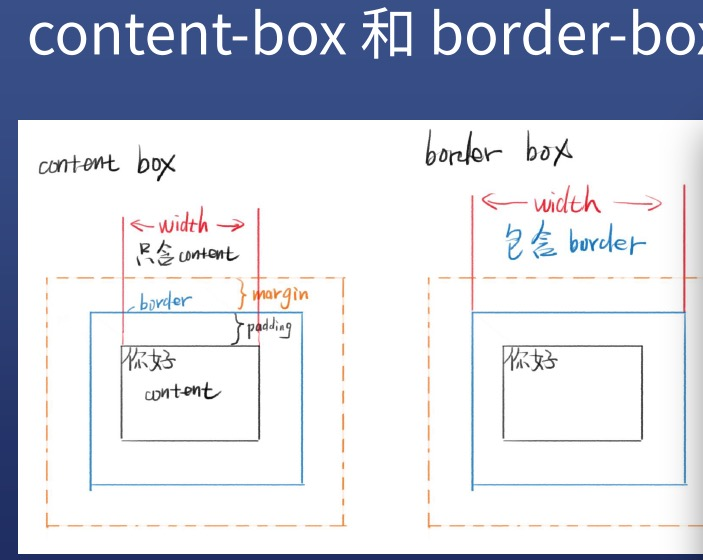

# 盒模型
## 盒模型分为两种
* content-box内容盒 内容就是盒子的边界
* border-box边框盒 边框是盒子的边界  最常用

包含：外边距margin, 边框border, 内边距padding，内容content
通常我们设置的背景显示区域，就是内容、内边距、边框这一块范围。
而外边距margin是透明的，不会遮挡周边的其他元素。

## 公式
content-box width = 内容宽度
border-box width = 内容宽度 + padding + border

## 哪个更好用？
border-box更好用

## margin合并
margin出现合并的情况
* 父子margin合并
* 兄弟margin合并
~~~css
.parent{
  border: 2px solid red;
}

.child{
  border: 2px solid blue;
  margin: 30px 0;
}
~~~

## 阻止合并的办法
* 父子合并用border/padding挡住
* 父子合并用overflow：hidden挡住
* 父子合并用display:flex
* 兄弟合并可以用inline-block消除